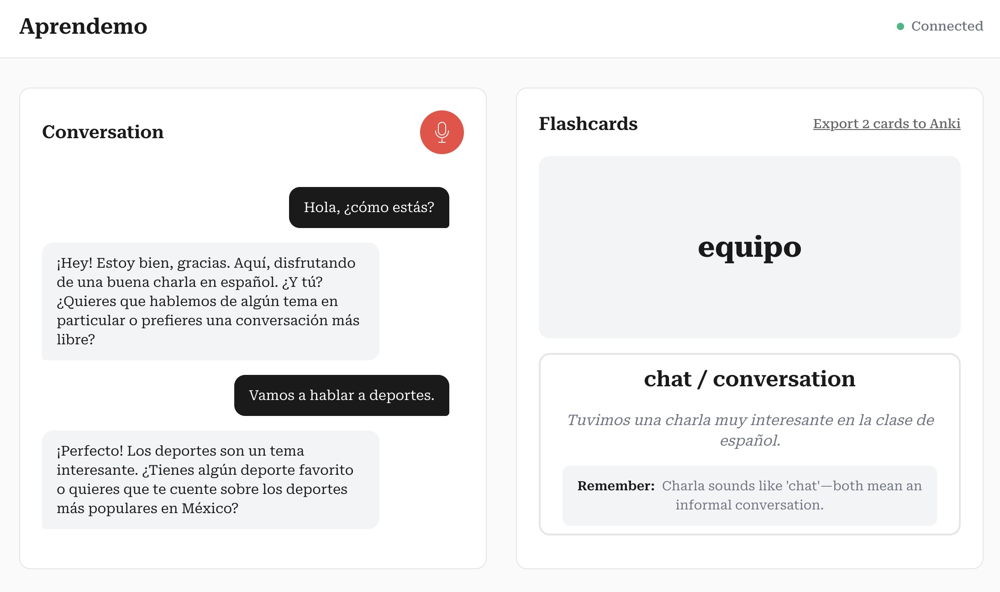

# Inworld Language Tutor

[](LICENSE)
[](https://inworld.ai/runtime)
[](https://docs.inworld.ai/docs/node/overview)
[](https://docs.inworld.ai/docs/models#llm)

A conversational language learning app powered by Inworld AI Runtime. Practice speaking with an AI tutor, get real-time feedback on your responses, and build vocabulary with auto-generated flashcards.



## Prerequisites

- Node.js (v20 or higher)
- npm
- An Inworld AI account and API key
- An AssemblyAI account and API key (for speech-to-text)

## Get Started

### Step 1: Clone the Repository

```bash
git clone https://github.com/inworld-ai/language-learning-node
cd language-learning-node
```

### Step 2: Install Dependencies

```bash
npm install
```

### Step 3: Configure Environment Variables

Create a `.env` file in the root directory:

```bash
INWORLD_API_KEY=your_inworld_base64_key
ASSEMBLY_AI_API_KEY=your_assemblyai_key
```

| Service | Get Key From | Purpose |
|---------|-------------|---------|
| **Inworld** | [platform.inworld.ai](https://platform.inworld.ai/) | AI conversations (Base64 API key) |
| **AssemblyAI** | [assemblyai.com](https://www.assemblyai.com/) | Speech-to-text |

### Step 4: Run the Application

**For development** (with auto-reload on file changes):

```bash
npm run dev
```

Open [http://localhost:3000](http://localhost:3000)

**For production**:

```bash
npm run build
npm start
```

### Step 5 (Optional): Set Up Supabase for User Auth

Without Supabase, the app works in anonymous mode using localStorage.

**a) Create a Supabase project** at [supabase.com](https://supabase.com)

**b) Push the database schema:**

```bash
npx supabase login
npx supabase link --project-ref YOUR_PROJECT_REF
npx supabase db push
```

Find your project ref in the Supabase dashboard URL: `supabase.com/dashboard/project/YOUR_PROJECT_REF`

**c) Create `frontend/.env.local`:**

```bash
VITE_SUPABASE_URL=https://YOUR_PROJECT.supabase.co
VITE_SUPABASE_PUBLISHABLE_KEY=your_anon_key
```

Find these in: Supabase Dashboard > Settings > API

## Repo Structure

```
language-learning-node/
├── backend/
│   ├── __tests__/            # Backend unit tests
│   ├── config/               # Language & server configuration
│   ├── graphs/               # Inworld Runtime conversation graphs
│   │   ├── configs/          # Graph JSON configurations
│   │   └── nodes/            # Custom graph nodes (STT, TTS, etc.)
│   ├── helpers/              # Audio utils, connection management, etc.
│   ├── prompts/              # Nunjucks prompt templates
│   ├── services/             # Server components
│   ├── utils/                # Logger
│   └── server.ts             # Express + WebSocket server entry point
├── frontend/
│   ├── src/
│   │   ├── __tests__/        # Frontend unit tests
│   │   ├── components/       # React components
│   │   ├── context/          # App state & auth (React Context)
│   │   ├── hooks/            # Custom React hooks
│   │   ├── services/         # WebSocket client, audio, storage
│   │   ├── styles/           # CSS
│   │   └── types/            # TypeScript types
│   └── vitest.config.ts      # Frontend test config
├── supabase/                 # Database migrations (optional)
├── deploy/                   # Deployment configurations
├── package.json
└── .env                      # Environment variables
```

## Architecture

The app uses a real-time audio streaming architecture:

1. **Frontend** captures microphone audio and streams it via WebSocket
2. **Backend** processes audio through an Inworld Runtime graph:
   - AssemblyAI handles speech-to-text with voice activity detection
   - LLM generates contextual responses in the target language
   - TTS converts responses back to audio
3. **Flashcards** are auto-generated from conversation vocabulary
4. **Response feedback** provides grammar and usage corrections

## Environment Variables Reference

| Variable | Required | Description |
|----------|----------|-------------|
| `INWORLD_API_KEY` | Yes | Inworld AI Base64 API key |
| `ASSEMBLY_AI_API_KEY` | Yes | AssemblyAI API key |
| `PORT` | No | Server port (default: 3000) |
| `LOG_LEVEL` | No | `trace`, `debug`, `info`, `warn`, `error`, `fatal` (default: info) |
| `NODE_ENV` | No | `development` or `production` |
| `ASSEMBLY_AI_EAGERNESS` | No | Turn detection: `low`, `medium`, `high` (default: medium) |

## Testing

Run the test suite to verify core functionality:

```bash
npm test              # Run all tests
npm run test:backend  # Backend tests only
npm run test:frontend # Frontend tests only
npm run test:watch    # Watch mode for backend
```

Tests cover critical paths: audio conversion, language configuration, storage persistence, and flashcard deduplication.

## Troubleshooting

**Bug Reports**: [GitHub Issues](https://github.com/inworld-ai/language-learning-node/issues)

**General Questions**: For general inquiries and support, please email us at support@inworld.ai

## Contributing

We welcome contributions! Please see [CONTRIBUTING.md](CONTRIBUTING.md) for guidelines on how to contribute to this project.

## License

This project is licensed under the MIT License - see the [LICENSE](LICENSE) file for details.
